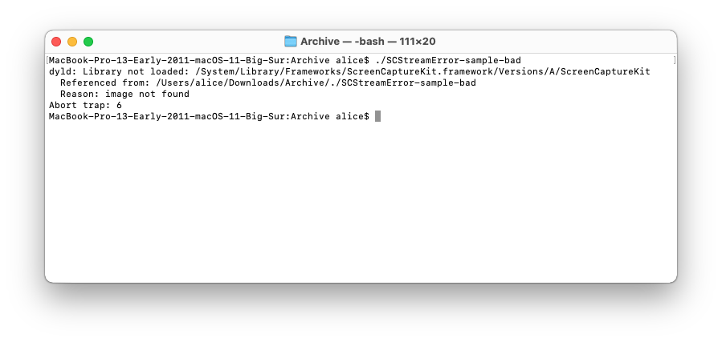

# SCStreamError Sample
***Make sure to [read my article](https://nonstrict.eu/blog/2023/mentioning-scstreamerror-crashes-on-older-macos-versions) about why mentioning SCStreamError crashes on older macOS versions.***

Minimal sample to demonstrates executables referencing SCStreamError fail to start when running on a macOS before 12.3, because it can't find ScreenCaptureKit.

My assumption is that this is because `SCError.h` doesn't have `API_AVAILABLE(macos(12.3))` annotations (at the time of writing 2023-03-09).

## Creating a build

```sh
swift build -c release --arch x86_64 --arch arm64
```

The resulting binary can be found at `.build/apple/Products/Release/scstreamerror-sample` and can run on both Intel and Apple Silicon Macs. 

## Demonstrating the issue

Running the build product will work as expected on macOS 12.3+, but will crash on macOS versions from before, that don't ship with ScreenCaptureKit. The error reports that `ScreenCaptureKit.framework` can't be loaded:

```
dyld: Library not loaded: /System/Library/Frameworks/ScreenCaptureKit.framework/Versions/A/ScreenCaptureKit
  Referenced from: /Users/alice/Downloads/Archive/./SCStreamError-sample-bad
  Reason: image not found
Abort trap: 6
```



## Workaround

Don't directy reference the `SCStreamError` or `SCStreamError.Code` types from code. Instead, use their raw values.

For example, instead of:

```swift
// Don't write this:
do {
    try await stream.stop()
} catch let error as SCStreamError where error.code == .attemptToStopStreamState {
    // ...
}
```

Instead use raw values:
```swift
// Write this instead:
let streamErrorDomain = "com.apple.ScreenCaptureKit.SCStreamErrorDomain"
let attemptToStopCode = -3808
do {
    try await stream.stop()
} catch let error as NSError where error.domain == streamErrorDomain && error.code == attemptToStopCode {
    // ...
}
```

## Authors

[Nonstrict B.V.](https://nonstrict.eu), [Mathijs Kadijk](https://github.com/mac-cain13) & [Tom Lokhorst](https://github.com/tomlokhorst), released under [MIT License](LICENSE.md).
